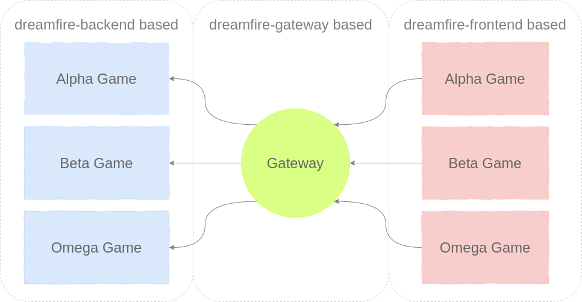

  

  Spartan, browser-based, multiplayer-ready, full stack game framework. Communications over GraphQL.

Used to create the games on (funnyfarm)[https://funnyfarm.andries.ca].

## Features

### GraphQL + Websocket communications

Apollo client and server is used under the hood to support effective GraphQL and WebSocket communication. Define your schema/resolvers in the backend, let Apollo take care of the rest. Reduces overfetching for game updates.

### HTML5 Canvas based

Probably a given for a web game framework, but also probably good to know!

### Somewhat libertarian design

Developer has control over many aspects of their game:
- OOP design
- GraphQL schema
- Drawing directly to canvas vs coordinate system abstraction
- Calling render only when needed
  - Real-time rendering: Call at an interval
  - Turn-based rendering: Call at network event

### Simple asset loading system

Images, audio and text can be preloaded prior to use. A callback is provided for when assets are preloaded. Tileset class also allows cutting up a tileset image for use in animation or elsewhere.

### Basic coordinate system

The framework attempts to abstract the need to calculate pixel offsets/sizes by providing some basic density-independent units. Size of coordinate space is provided by developer. If not defined, a responsive coordinate space is generated.

### Basic animation system

Extendable animation classes/types. Sequencing and grouping animations is also possible. All predefined animations are linear.

Predefined effects:
- Keyframe effect: changes a current index for a given size of frames. useful for animating tilesets
- Dimension effect: changes the position/size of an object
- "DrawProps" effect: changes shadow blur, line width and dash

### Basic collision detection

Helper classes that assist in collision detection are provided. Uses quad-trees under the hood.

### Really basic authentication

The gateway creates a JWT with a random user ID. The backend receives a `userId` in the context. Can be used to differentiate users.

### One UI element

UI overlay is provided. A simple button can be rendered within that overlay. UI control is extendable, if more controls are needed.

### Microservice design

Make as many games as you want, all hosted under a single HTTPS port! The gateway allows stitching multiple game schemas together. Also supports proxying the WebSockets to the proper backend for the game.

## Usage

1. Copy the `template` folder to your own repo
2. Run
  - `npm install dreamfire-frontend` in the `frontend` folder
  - `npm install dreamfire-gateway` in the `gateway` folder
  - `npm install dreamfire-backend` in the `backend` folder
3. Start all three projects
4. Append `?u=Bob&g=Group` to the frontend URL. In the predefined template, `u` is parsed as the username and `g` is parsed as the group name.
